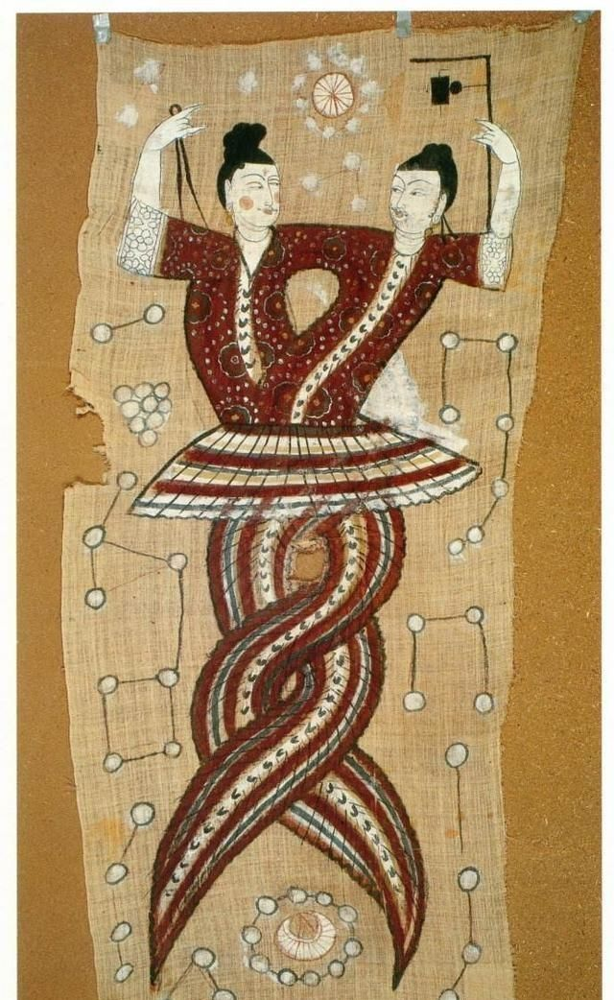

沉思录
======
这是一本形而上的书，每一篇小短文都在陈述如今一些非常时髦的概念

#. 传承
    #. 品质闪耀在良好的传承中

        *一方面能够强健地承受，另一方面又能够保持清醒的品质，
        正是一个拥有完善的、不可战胜灵魂的人的标志*

    #. 不干涉他人事物
    #. 不轻信流言诽谤
    #. 不要陷入碌碌琐事
    #. 不迷信
    #. 不畏惧，不热衷战斗
    #. 让别人说话
    #. 不进行繁琐的劝解
    #. 不露锋芒
    #. 宽恕
    #. 理性
    #. 意志的自由，目标的坚定不移
    #. 温柔宽厚，不苛责
    #. 观察

#. 掌控
    *唯一能从一个人那里夺走的只有现在，如果这个是真的，即一个人只拥有现在，那么一个人就不可能呢丧失他不拥有的东西*

    #. 来自命运的东西并不脱离其本性
    #. 唯一能被夺走的只有现在

#. 能量
    *我们应当在思想进行中抑制一切无目的，无价值的想法，以及大量好奇和恶意的感情*

    #. 享受你认为美好东西的快乐
    #. 最长久的名声也是短暂的

#. 行动
    *一个人退到任何地方都不如退到自己的心灵中更为宁静和美好，特别是当他心中有这种思想的时候*

    #. 任何行为都不要无目的的作出
    #. 使用你的智慧仅仅用于正直的行动

#. 方向
    *尊重宇宙中最好的东西，这就是利用和指引所有事物的东西， 同样的尊重你自己身体中最好的东西*

    #. 尊重自己和共同的本性
    #. 寻求不可能的事情是发疯

#. 真正的活着
    *这是令人羞愧：当你的身体还没有衰退，你的灵魂就先在生活中衰退*

    #. 灵魂保持在一种状态与活动之中
        天地不仁，以万物为刍狗。尊重规律，承担责任。不作恶，屠龙不变恶龙
    #. 灵魂先与身体早衰是让人羞愧的
    #. 没有人能阻止你按本性生活

#. 追求
    *不要老想着你已有的和没有的东西，而是想着你认为最好的东西。
    道德品格的完善在于把每一天都当作最后一天来度过，既不对刺激作出猛烈的反应，也不麻木不仁或者虚伪*

    #. 多少人在享受了赫赫威名之后被人遗忘
    #. 热切的追求你认为最好的东西
    #. 痛苦不是不可忍受或者永远持续的

#.
    如过你能敏锐的观察，就能明智的调查和判断

    #. 幸福在于做人本性所要求的事情
    #. 使你的生活井然有序是你的义务
    #. 人是为了彼此对方而存在的

#.
    让你的行为活动限定与有利于社会行为，这符合你的本性

    #. 与保持同样原则的人同行
    #. 在外来事物的打扰中保持自由
    #. 不同无知的人做无所谓的交谈

#.
    *宇宙的本性带给每一件事物的东西都有理由他们。当本性带给他们时，那是为了他们的利益*

    #. 因果的织机永恒的织着与你相关的线
    #. 认识真正按照本性生活的人
    #. 操纵你的是隐蔽在内部的信念

#. 人性

    *人们互相蔑视，又互相奉承；人们各自希望高于别人，有各自匍匐于别人面前*

    #. 我为普遍利益做过什么
    #. 人们互相蔑视又互相奉承
    #. 总是想着有德之士

#. 归宿

    *每个人都爱自己甚于爱别人，但他重视别人对自己的意见，缺胜于重视自己对自己的意见*

    #. 在无望完成的事中也要训练自己
    #. 死亡不是一件可怕的事情